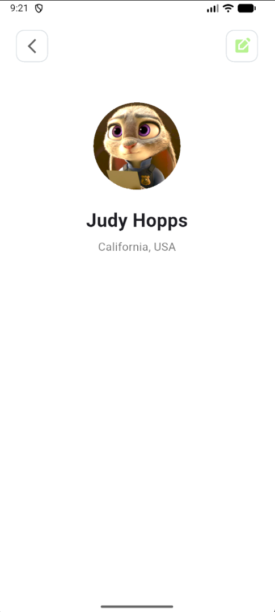

# bai_tap_1

Câu 1: Mong muốn và định hướng của bạn là gì sau khi học xong môn học là gì?

Trả lời:
    Sau khi học môn lập trình di động, em mong muốn nắm được cách xây dựng một ứng dụng hoàn chỉnh từ giao diện tới xử lý chức năng cơ bản. Trước đây em chủ yếu làm về web nên phần mobile em còn khá hạn chế. Em hy vọng sau môn học này em có thể tự làm một app nhỏ chạy được trên máy thật, không chỉ chạy mô phỏng.

    Về định hướng lâu dài thì em chưa quyết hẳn, nhưng em nghĩ lập trình di động là kỹ năng cần thiết và thực tế. Nếu học xong thấy phù hợp thì em có thể tiếp tục tìm hiểu sâu hơn về Flutter để làm dự án cá nhân hoặc xin thực tập, còn nếu không thì ít nhất em cũng có thêm kiến thức nền tảng để phục vụ các môn sau.

Câu 2: Theo bạn trong tương lai gần (10 năm) lập trình di động có phát triển không? Tại sao?

Trả lời:

    Theo quan điểm của em, trong 10 năm tới lập trình di động vẫn tiếp tục phát triển mạnh. Lý do là nhu cầu sử dụng điện thoại đang ngày càng tăng. Hầu hết các dịch vụ hiện nay đều có ứng dụng riêng: ăn uống, học tập, ngân hàng, đặt lịch, giải trí,… nên nhu cầu về ứng dụng di động rất lớn.

    Ngoài ra, các xu hướng như AI, IoT, thiết bị thông minh… cũng cần app để điều khiển hoặc kết nối. Con người gần như lúc nào cũng mang theo điện thoại bên mình, vì vậy ứng dụng mobile vẫn là kênh quan trọng nhất để tương tác với người dùng.

Câu 3: Ứng dụng

